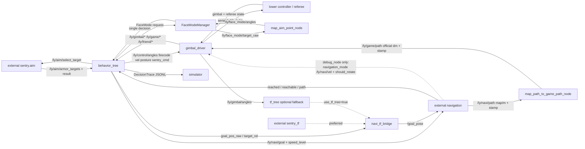

# ros2_ly_ws_sentry Knowledge Graph

Generated: 2026-07-16T00:00:00+00:00

Checked against HEAD: `f01fc6e056e8992124b1cc46e12f4491bacb5fc4` (dirty integration worktree; source-only audit)

Current graph shape: 72 nodes, 82 edges, 6 layers.

Current ROS packages covered by graph:

- `auto_aim_common`
- `behavior_tree`
- `gimbal_driver`
- `navi_tf_bridge`
- `simulator`
- `tf_tree`

## Outputs

- JSON graph: `.understand-anything/knowledge-graph.json`
- Scan inventory: `.understand-anything/intermediate/scan-result.json`
- Metadata: `.understand-anything/meta.json`
- Read-only dashboard: `python3 scripts/understand_graph_dashboard.py` -> `http://127.0.0.1:1037/`
- Detailed project graph: `docs/architecture/2026-07-12_project_link_graph.md`
- Detailed Regional graph: `docs/sentry/regional/2026-07-12_regional_decision_graph.md`

## Notes

- 正式目標來源只有外部 `/ly/aim/armor_targets` 與 `/ly/aim/result`；BT 不再訂閱舊內部輔瞄 topic。
- FaceMode 的 Regional、Buff、Outpost 請求統一由 `FaceModeManager` 收集並仲裁；最終角度/FireCode 仍只由 BT 的單一控制出口發布。
- `PreRoadland`、`Roadland` 是正式同級 MainArea：前者走 ID 25 的 MyPreRoadland 到點保持；後者保留名稱但改用 ReadyRoadLand 邊界，保留 ID 21/22 的 MyRoadland 強綁定穿越。Simulator 會分別繪製兩個正式主區，並保留獨立的 `RoadlandFollow` 穿越子區。`UnitInfo.area_id` 新增 8/9 表示敵我 PreRoadland，既有 0-7 不變。
- `auto_aim_common` 是正式共用介面包：`GoalReach` 用於 reached 狀態，`RelativeTarget` 用於導航追擊。
- `TypeID=10` 提供 `sentry_info_3` 和精確敵我前哨血量；TypeID=1 的 `GameCode * 25` 只作 fallback。
- `DownlinkTypeID=0x00~0x04` 為控制、SentryCmd、0x0307 路徑、0x0308 自訂訊息與自身座標。
- `gimbal_driver` 的串口/下位機基線集中在 `src/gimbal_driver/config/gimbal_driver_config.yaml`；正式 `sentry_all` 只會載入它，不會把全域 YAML 注入 driver。
- `io_config.serial_mode=true` 時，逐 ID raw 觀測 topic 為 `/ly/upload/typeid0..10` 與 `/ly/download/typeid0x00..04`；語義 topic 保持不變。
- `io_config.navigation_mode` 僅由 `src/gimbal_driver/config/navigation_test.yaml` 的單節點 `debug_node.launch.py` profile 啟用；可讓 `gimbal_driver` 直連 `/ly/navi/vel` 與 `/ly/navi/should_rotate`，正式導航控制仍經 BT 發布 `/ly/control/*`。
- 2026-07-16 source audit 補上 JSON graph 的 aim feedback、`/ly/control/sentry_cmd`、FaceMode solver、BT 0x04 position downlink、導航 feedback、`debug_node -> navigation_test.yaml` profile 與正確的 `tf_tree -> navi_tf_bridge` fallback；targeted build、static selfcheck 與虛擬 `debug_node` launch 均已在 source ROS Humble、`sentry.common`、本 workspace 後通過，尚未做完整 `sentry_all` runtime graph 驗證。
- 本圖譜為 source-checked fallback；因本機沒有可用 Understand Anything plugin core，未執行 plugin regeneration。
