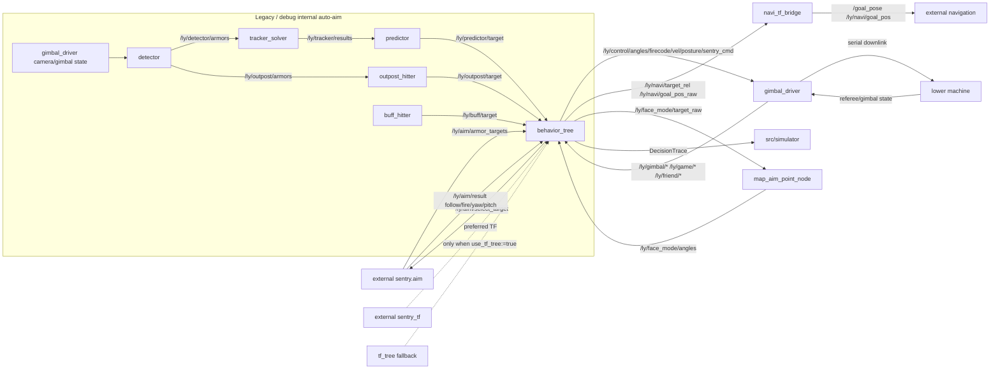

# ros2_ly_ws_sentry Knowledge Graph

Generated: 2026-06-26T07:26:03+00:00

## Outputs

- JSON graph: `.understand-anything/knowledge-graph.json`
- Scan inventory: `.understand-anything/intermediate/scan-result.json`
- Metadata: `.understand-anything/meta.json`

## Notes

- 正式主鏈是 decision-only。
- `detector/tracker_solver/predictor/outpost_hitter/buff_hitter` 是 legacy/debug，不是 `sentry_all` 正式主鏈。
- 這份圖譜是 package/topic/file 級，不是完整 AST function call graph。
