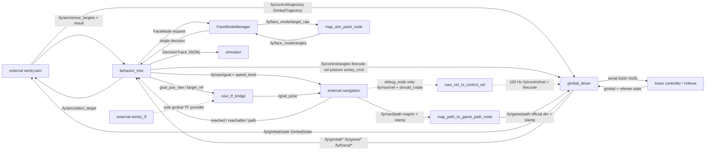

# ros2_ly_ws_sentry Knowledge Graph

Generated: 2026-07-18T22:09:17+08:00

Checked against committed source HEAD: `183fd217c6ef168bc66619637400596fb25db21f` (working tree contains the source-checked Regional PreRoadland/Roadland activation, graph refresh, and the user-owned docs/rules lock file)

Current graph shape: 81 nodes, 101 edges, 6 layers.

Current ROS packages covered by graph:

- `auto_aim_common`
- `behavior_tree`
- `gimbal_driver`
- `navi_tf_bridge`
- `simulator`

前哨強化交戰鎖：`/ly/enemy/op_hp` 的新鮮正值與 target 7 建立鎖；HP 下降只可 arm 一次強化進攻 `4`。`PostureManager` 仍是唯一 `/ly/control/posture` owner，並以 `posture=1 && enhanced_posture=true` 確認強攻。

## Outputs

- JSON graph: `.understand-anything/knowledge-graph.json`
- Scan inventory: `.understand-anything/intermediate/scan-result.json`
- Metadata: `.understand-anything/meta.json`
- Read-only dashboard: `python3 scripts/understand_graph_dashboard.py` -> `http://127.0.0.1:1037/`
- Detailed project graph: `docs/architecture/2026-07-12_project_link_graph.md`
- Detailed Regional graph: `docs/sentry/regional/2026-07-12_regional_decision_graph.md`

## Notes

- 正式目標來源只有外部 `/ly/aim/armor_targets` 與 `/ly/aim/result`；BT 不再訂閱舊內部輔瞄 topic。
- FaceMode 的 Regional、Buff、Outpost 請求統一由 `FaceModeManager` 收集並仲裁；最終角度/FireCode 仍只由 BT 的單一控制出口發布。
- `PreRoadland`、`Roadland` 是正式同級 MainArea：前者走 ID 25 的 MyPreRoadland 到點保持；後者保留名稱但改用 ReadyRoadLand 邊界，保留 ID 21/22 的 MyRoadland 強綁定穿越。正式 `regional_competition.json` 把兩者都列為 Default 可選區域；兩者設定分別由 `AreaManager.RegionalAreaTask.MyPreRoadland/MyRoadland` 所有。Simulator 會分別繪製兩個正式主區，並保留獨立的 `RoadlandFollow` 穿越子區。`UnitInfo.area_id` 新增 8/9 表示敵我 PreRoadland，既有 0-7 不變。
- `auto_aim_common` 是正式共用介面包：`GoalReach` 用於 reached 狀態，`RelativeTarget` 用於導航追擊。
- `TypeID=10` 提供 `sentry_info_3` 和精確敵我前哨血量；TypeID=1 的 `GameCode * 25` 只作 fallback。
- `DownlinkTypeID=0x00~0x05` 為控制、SentryCmd、0x0307 路徑、0x0308 自訂訊息、自身座標與 MPC trajectory；0x02 每次以相同 sequence 的兩段 64B CRC16 fragment 傳送，重組後仍是完整 107B / 50 點路徑。TypeID 11 动态反馈与 TypeID 0 角度组合为 `/ly/gimbal/state`，driver 使用 SensorData QoS、拒绝非有限 trajectory，并默认每 20ms 周期发布状态。
- `gimbal_driver` 的串口/下位機基線集中在 `src/gimbal_driver/config/gimbal_driver_config.yaml`；正式 `sentry_all` 透過 `gimbal_driver.launch.py` 載入它，並只把 root `base_config_file`／`config_file` 的安全 `io_config` 相容鍵路由給 driver，絕不把全域 YAML 注入 BT、導航或 FaceMode。
- `io_config.serial_mode=true` 時，逐 ID raw 觀測 topic 為 `/ly/upload/typeid0..11` 與 `/ly/download/typeid0x00..05`；語義 topic 保持不變。
- `src/gimbal_driver/config/debug_mode.yaml` 是 `debug_node.launch.py` 載入的 bridge profile；內建 `navi_vel_to_control_vel.py` 以 100 Hz 將 `/ly/navi/vel` 轉為正式 `/ly/control/vel`、將 `/ly/navi/should_rotate` 轉為 partial `/ly/control/firecode`，500 ms stale 時發布零速度。driver 保持正式 control subscriber，兩類控制最終以同一 `GimbalControlFrame` 下行；此入口不啟動 BT，故不消費也不宣告 `SetPostureToMoveWhenFalse`。正式 root 相容路由明確略過 `navigation_test`／`navigation_mode`。
- 正式 BT 的 `src/behavior_tree/config/NaviRotateControl.yaml` 可透過 `SetPostureToMoveWhenFalse` 讓新鮮 `/ly/navi/should_rotate=false` 僅覆蓋當拍目標姿態為 Move；現有 `PostureManager` 繼續獨佔 cooldown、hold、feedback 與 pending/retry。若冷卻等待中訊號轉 true 或過期，下一拍恢復原策略，因此不補發 Move。這是正式 BT key，不是 driver debug profile key。
- 2026-07-16 source audit 移除本倉 `tf_tree` fallback；外部 `sentry_tf` 是唯一 gimbal TF provider。aim feedback、`/ly/control/sentry_cmd`、FaceMode solver、BT 0x04 position downlink、導航 feedback、`debug_node -> debug_mode.yaml` profile 與 root gimbal compatibility routing 保持不變；source ROS Humble、`sentry.common` 後，本次 `behavior_tree` 與 `simulator` 184 tests 及 static selfcheck（108 PASS／0 WARN／0 FAIL）均通過，完整 external aim runtime graph 驗證仍未執行。
- 本圖譜為 source-checked fallback；因本機沒有可用 Understand Anything plugin core，未執行 plugin regeneration。MPC 的 ROS schema 由本倉 `gimbal_driver/msg/GimbalState.msg` 與 `GimbalTrajectory.msg` 定義；外部 `sentry.aim` 只經既有 topic 消費狀態、發布軌跡，不是本倉建置依賴。
