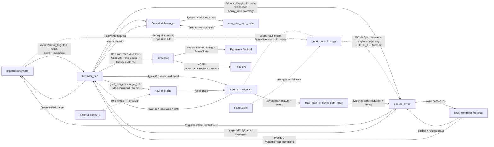

# ros2_ly_ws_sentry Knowledge Graph

Generated: 2026-07-20T07:17:20Z

Checked against runtime source baseline: `a16e1af` (DecisionTrace v4, the tactical simulator, and the final Regional Area/Tactical YAML wiring are reflected; an untracked LibreOffice temporary lock file is intentionally excluded)

Current graph shape: 107 nodes, 145 edges, 6 layers.

Current ROS packages covered by graph:

- `auto_aim_common`
- `behavior_tree`
- `gimbal_driver`
- `navi_tf_bridge`
- `simulator`

前哨強化交戰鎖：`/ly/enemy/op_hp` 的新鮮正值與 target 7 建立鎖；HP 下降只可 arm 一次強化進攻 `4`。`PostureManager` 仍是唯一 `/ly/control/posture` owner，並以回讀 `posture=1 && enhanced_posture=true` 確認強攻。正式 Regional 普通姿態同樣必須等待 `/ly/gimbal/posture` 回讀，不再使用未曾收到回讀時的樂觀確認。

## Outputs

- JSON graph: `.understand-anything/knowledge-graph.json`
- Scan inventory: `.understand-anything/intermediate/scan-result.json`
- Metadata: `.understand-anything/meta.json`
- Read-only dashboard: `python3 scripts/understand_graph_dashboard.py` -> `http://127.0.0.1:1037/`
- Detailed project graph: `docs/architecture/2026-07-12_project_link_graph.md`
- Detailed Regional graph: `docs/sentry/regional/2026-07-12_regional_decision_graph.md`

## Notes

- 正式目標來源只有外部 `/ly/aim/armor_targets` 與 `/ly/aim/result`；BT 不再訂閱舊內部輔瞄 topic。
- FaceMode 的 Regional、Buff、Outpost 請求統一由 `FaceModeManager` 收集並仲裁；最終角度/FireCode 仍只由 BT 的單一控制出口發布。`camera_projection` 預設先查長焦 `gx_camera_0`，只有 TF、距離或投影解算失敗時才回退短焦 `gx_camera_1`；status 會回報實際成功 frame，`relative_geometry` 不使用這個 fallback。
- `PreRoadland`、`ReadyRoadland` 是正式同級 MainArea：前者走 ID 25 的 MyPreRoadland 到點保持；後者使用原 ReadyRoadLand 邊界，保留 ID 21/22 的 MyReadyRoadland 強綁定穿越。舊 `Roadland` alias 與未使用的 `RoadlandFollow` helper 已移除。正式 `regional_competition.json` 把兩者都列為 Default 可選區域；巡邏時序與門檻由程式正式預設所有，不再由 AreaManager 注入。RegionalDefense 將前後段聚合為 RoadCorridor 防守覆蓋。Simulator 會分別繪製兩個正式主區。`UnitInfo.area_id` 新增 8/9 表示敵我 PreRoadland，既有 0-7 不變。
- JSON 的 `DecisionAutonomy.NaviGoal` 保留完整 profile 基線；正式 Regional 讀完 `AreaManager.yaml` 後，其全域和五個 per-area Enable 會重寫 `MyArea/CommonArea` 的最終可達 scope，`EnemyArea` 保持 JSON。`sentry_all` 將同一份 YAML 的結果同步傳給 `navi_tf_bridge` Chase area limit。仍有替代候選時，剛選過的區域延後到本輪最後。若 MyBase/MyPreRoadland/CommonCentral 等 yieldable Default task 被 Buff/Outpost、RegionalDefense 或 Special 暫時搶占，會記為 `preempted`，下一次只要仍 eligible 就先續走原區域；首次恢復選點若不 eligible 則立即丟棄該恢復權，Recovery、timeout、unreachable、unhealthy 也維持終止。MyBase route 是程式固定的四個 Castle 點、每點保持 15 秒；`Base.yaml`／`base_strategy_config_file` 與 MyBase `Patrol.GoalWeights` 注入已移除。`BuffOutpost`、`HoleRoad`、`OutpostGuard` 不再由 Default 發布，`BuffOutpost` 只由 Buff/Outpost Tactical 擁有。
- `ChasePolicy` 是 Regional Tactical 的導航授權：只在可讓出的 Default `RegionalAreaTask` 已承諾區域時，接受新鮮官方敵方坐標精確落在同一 `AreaKey`，並由 `Chase.yaml` 開啟該 planned area。缺失/過期座標、邊界外或 nearest fallback、異區、未開啟區域一律不追；拒絕只清本拍 chase 輸出，原 Default goal 持續。Chase 在 Tactical，位於目前預設關閉的 Special 之前；League/Showcase 保留既有 area-scope。bridge 的 `Chase.AreaLimit` 解析 Base、Highland、PreRoadland、ReadyRoadland 與 Central 共 9 個現行主區，舊 `roadland` token 只兼容 ReadyRoadland。
- `Task.OutpostConfirm.OpeningHoldUntilWindowEnd=true` 時，`OutpostOpeningHold.hpp` 以 `[0, OpeningHoldSec)` 作為唯一 hard hold 邊界；預設 `OpeningHoldSec=120` 在前哨 safety gate 合格時固定 BuffOutpost navigation ownership 到第 120 秒前，Default、普通巡邏與 soft tactical 不可換點。hard hold 的 priority 不依賴 `OpeningHighPriority`，後者只控制非 hold 的一般開局時間窗。前哨已毀、不可達、受擊/資源安全 gate、Hard Recovery 與己方 Base 的 RegionalDefense 硬威脅保留接管權。
- `GoalReachState` 是到達/不可達的唯一 final contract：raw `/ly/navi/reached`、`/ly/navi/reachable` 和融合坐標只提供證據。EventManager、regional area task、recovery 和 navigation watchdog 都只消費 composite status；watchdog 已移除 raw fallback 與獨立 140 cm 到達半徑。Default 的 MyHighland、MyPreRoadland、MyReadyRoadland guard 和每一個 CommonCentral 巡邏點均和 MyBase 一樣保持 15 秒；純行進 phase 不加駐留。
- `TypeID=9` 的裁判 `0x0303 map_command_t` 以 `/ly/game/map_command` 進 BT。官方幀是 float 米制，但下位機上傳時已轉換為 int16 厘米；`gimbal_driver` 解碼後再轉回 ROS 的 float 米制語義。`Task.MapCommand` 只接受官方場地內的坐標模式點，預設持有 45 秒並在 20cm 內去重；它直接發布 `/ly/navi/goal_pos_raw` 官方厘米坐標給 bridge，不直接發布 `/goal_pose`。同點的 5x/100ms 與 1Hz 重送不續期；目標機器人模式沒有坐標，不導航。MapCommand 高於 Default/Tactical/Special，整個 Hard 層（Recovery 與 ReadyRoadland 不可中斷穿越）可取消它。其持有期間清除舊 BaseGoal 的外部 status binding 並不發布 `GoalReachState`，避免任意坐標污染區域到點契約。
- `auto_aim_common` 是正式共用介面包：`GoalReach` 用於 reached 狀態，`RelativeTarget` 用於導航追擊。
- `TypeID=10` 提供 `sentry_info_3` 和精確敵我前哨血量；TypeID=1 的 `GameCode * 25` 只作 fallback。
- `DownlinkTypeID=0x00~0x05` 為控制、SentryCmd、0x0307 路徑、0x0308 自訂訊息、自身座標與 MPC trajectory；0x02 每次以相同 sequence 的兩段 64B CRC16 fragment 傳送，重組後仍是完整 107B / 50 點路徑。TypeID 11 动态反馈与 TypeID 0 角度组合为 `/ly/gimbal/state`，driver 使用 SensorData QoS、拒绝非有限 trajectory，并默认每 20ms 周期发布状态。
- `gimbal_driver` 的串口/下位機基線集中在 `src/gimbal_driver/config/gimbal_driver_config.yaml`；正式 `sentry_all` 透過 `gimbal_driver.launch.py` 載入它，並只把 root `base_config_file`／`config_file` 的安全 `io_config` 相容鍵路由給 driver，絕不把全域 YAML 注入 BT、導航或 FaceMode。
- `io_config.serial_mode=true` 時，逐 ID raw 觀測 topic 為 `/ly/upload/typeid0..11` 與 `/ly/download/typeid0x00..05`；語義 topic 保持不變。
- `/ly/aim/result` 是外部 aim 唯一輸出：`follow`、`fire`、yaw/pitch 及 yaw/pitch 的速度、加速度。正式 BT 與 `debug_mode.yaml` 的單節點 bridge 各自在所屬模式把新鮮有效的六個運動欄位轉為本倉 `GimbalTrajectory`，並以 100 Hz `/ly/control/trajectory` 驅動 0x05；兩者不可並行。任一欄非有限、`follow=false` 或 stale 時不發 trajectory，angles／FireCode 的既有有效性語義也一併失效。
- 正式 BT 的 `src/behavior_tree/config/NaviRotateControl.yaml` 可透過 `SetPostureToMoveWhenFalse` 讓新鮮 `/ly/navi/should_rotate=false` 僅覆蓋當拍目標姿態為 Move；現有 `PostureManager` 繼續獨佔 cooldown、hold、feedback 與 pending/retry。若冷卻等待中訊號轉 true 或過期，下一拍恢復原策略，因此不補發 Move。這是正式 BT key，不是 driver debug profile key。
- `src/behavior_tree/config/Tactical.yaml` 是正式全域小陀螺預設與受擊 `0 -> 1 -> 2 -> 3` ramp 時序的唯一來源，並提供 `ProtectHero.Enable` 與 `ProtectCastle.Enable/RFID/EnemyPos`：前者最終覆蓋 HeroProtection 基線；ProtectCastle 的總開關關閉兩條來源，RFID 只關閉堡壘增益點 `2/3` 事件及站樁火控，EnemyPos 只關閉敵方實際進入 MyBase 的防守來源，Highland、道路與 Central 的普通 RegionalDefense 不受影響；PointManager 已移除。`AreaManager.yaml` 的 `RegionalAreaTask.Enable` 與 `MyBase/MyHighland/MyPreRoadland/MyReadyRoadland/CommonCentral.Enable` 是比賽切換可去區域的最終 core scope：`false` 不會產生該區域 Default 候選，也會停止已啟動的同類任務，並同步限制 bridge Chase；JSON `EnemyArea` 不受影響。任何 BT 策略本拍要求 `FollowMode=1` 都在 Tactical 與防守 Rotate 計算後強制輸出 `Rotate=0`；safe fallback 同樣先清 FollowMode，再發 `FIELD_ALL`。
- 2026-07-20 離線 source 驗證：AreaManager scope 專屬測試與既有區域測試共 23/23 通過，無 node 的正式 launch 解析確認五個 YAML 開關會同步進 bridge，manual Outpost 時 bridge `/goal_pose` 有效值為 false。本機舊版 `sentry_msgs/AimResult` 缺少四個 dynamics 欄位時，BT 仍可建置並安全拒絕 legacy aim trajectory/fire；`offline:=true` 既不 source `sentry.aim`，也不要求 extended AimResult，因此可由 simulator mock 獨立啟動。正式鏈仍強制 extended AimResult contract。
- `DecisionTrace` v4 以 BT 同一份 Tactical/RegionalDefense policy helper 寫入 ProtectCastle、ProtectHero 和 RegionalDefense evidence；它同時保留最後一次實際 `/ly/control/*` output snapshot，並與 lower-machine `/ly/gimbal/firecode` feedback 明確分開。v2/v3 replay 將未寫入的 evidence 標為 `not_recorded`，不以零值代替。`src/simulator/config/tactical_catalog.yaml` 與 `SceneState` 是 Pygame 和 `/tactical` 的共同 scene contract：`mock` 模式只有 `simulator.mock_inputs` 發正式輸入，`manual_ros` 只觀察 Foxglove/ROS CLI。`scripts/python/start.py` 預設載入 `tactical_board.yaml` 的紅藍完整 14 單位 roster，並保留敵 Hero 進 MyBase 的開局防守情境。MCAP 額外輸出 `control_output`、`tactical` 和 `scene` channels；browser 拖放和 `tactical_board.yaml` Pygame smoke 均有回歸驗證。
- 本圖譜為 source-checked fallback；因本機沒有可用 Understand Anything plugin core，未執行 plugin regeneration。MPC 的 ROS schema 由本倉 `gimbal_driver/msg/GimbalState.msg` 與 `GimbalTrajectory.msg` 定義；外部 `sentry.aim` 只經既有 topic 消費狀態、發布軌跡，不是本倉建置依賴。
