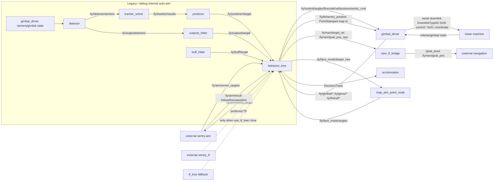

# ros2_ly_ws_sentry Knowledge Graph

Generated: 2026-07-07T16:58:59+00:00

Checked against HEAD: `84af1f3e758edad06802479b2357102a47c29778`

Current graph shape: 182 nodes, 186 edges, 6 layers.

Current ROS packages covered by graph:

- `auto_aim_common`
- `behavior_tree`
- `buff_hitter`
- `buff_shooting_table_calib`
- `detector`
- `gimbal_driver`
- `navi_tf_bridge`
- `outpost_hitter`
- `predictor`
- `shooting_table_calib`
- `simulator`
- `tf_tree`
- `tracker_solver`

## Outputs

- JSON graph: `.understand-anything/knowledge-graph.json`
- Scan inventory: `.understand-anything/intermediate/scan-result.json`
- Metadata: `.understand-anything/meta.json`

## Notes

- 正式主鏈是 decision-only。
- `detector/tracker_solver/predictor/outpost_hitter/buff_hitter` 是 legacy/debug，不是 `sentry_all` 正式主鏈。
- 這份圖譜是 package/topic/file 級，不是完整 AST function call graph。
- 本次核對時工作區有未提交改動；已確認當前 graph module 清單與 `src/*/package.xml` 的 13 個 ROS 包一致。
- 2026-07-08 fallback update：新增 `/ly/bt/sentry_position`（`behavior_tree` -> `gimbal_driver`）和 `DownlinkTypeID=0x00/0x01` 下行 frame 摘要；package/module 清單未重掃，仍以現有 `src/*/package.xml` 覆蓋為準。
