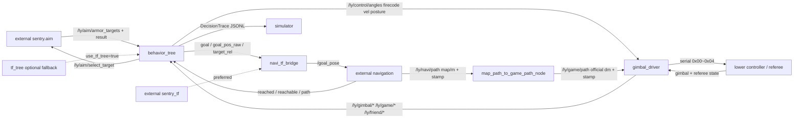

# ros2_ly_ws_sentry Knowledge Graph

Generated: 2026-07-12T00:00:00+08:00

Checked against HEAD: `8e041f5610a4e62b8bcb329e53fe974d3630d7dc` (dirty worktree)

Current graph shape: 59 nodes, 52 edges, 6 layers.

Current ROS packages covered by graph:

- `auto_aim_common`
- `behavior_tree`
- `gimbal_driver`
- `navi_tf_bridge`
- `simulator`
- `tf_tree`

## Outputs

- JSON graph: `.understand-anything/knowledge-graph.json`
- Scan inventory: `.understand-anything/intermediate/scan-result.json`
- Metadata: `.understand-anything/meta.json`
- Read-only dashboard: `python3 scripts/understand_graph_dashboard.py` -> `http://127.0.0.1:1037/`
- Detailed project graph: `docs/architecture/2026-07-12_project_link_graph.md`
- Detailed Regional graph: `docs/sentry/regional/2026-07-12_regional_decision_graph.md`

## Notes

- 正式目標來源只有外部 `/ly/aim/armor_targets` 與 `/ly/aim/result`；BT 不再訂閱舊內部輔瞄 topic。
- `auto_aim_common` 是正式共用介面包：`GoalReach` 用於 reached 狀態，`RelativeTarget` 用於導航追擊。
- `TypeID=10` 提供 `sentry_info_3` 和精確敵我前哨血量；TypeID=1 的 `GameCode * 25` 只作 fallback。
- `DownlinkTypeID=0x00~0x04` 為控制、SentryCmd、0x0307 路徑、0x0308 自訂訊息與自身座標。
- 本圖譜為 source-checked fallback；因本機沒有可用 Understand Anything plugin core，未執行 plugin regeneration。
