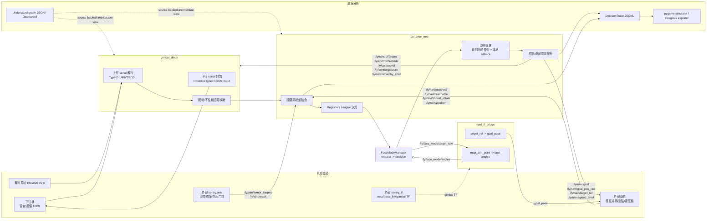

# 哨兵工程全鏈路圖

Updated: 2026-07-12

> 範圍：`ros2_ly_ws_sentry` 的當前正式 decision-only 主鏈。外部導航、外部 `sentry.aim`、外部 `sentry_tf` 與下位機韌體不在本倉庫內；圖中只標示它們的 ROS 或串口契約，不把其內部實作當作本工程事實。

## 1. 工程主鏈



## 2. 下位機、裁判與 ROS 語義

```mermaid
flowchart TB
  LOWER_RX[下位機/裁判上行] --> TYPE1[TypeID 1\nGameCode 壓縮狀態]
  LOWER_RX --> TYPE4[TypeID 4\nRFID/Buff 等自訂壓縮]
  LOWER_RX --> TYPE6[TypeID 6\nDamageDifference int16]
  LOWER_RX --> TYPE7[TypeID 7\n單位血量等狀態]
  LOWER_RX --> TYPE8[TypeID 8\nRFID status_2]
  LOWER_RX --> TYPE10[TypeID 10\nsentry_info_3 + 精確前哨站血量]

  TYPE6 --> DIFF[/ly/game/damage_difference]
  TYPE4 --> RFID[/ly/game/rfid]
  TYPE7 --> HP[/ly/friend/hp\n/ly/enemy/hp]
  TYPE10 --> INFO3[/ly/game/sentry/info\nhas_sentry_info_3\nremaining seconds\nage_ms]
  TYPE10 --> OP_EXACT[/ly/friend/op_hp\n/ly/enemy/op_hp\n精確 HP、敵我分開]
  TYPE1 --> OP_FALLBACK[GameCode 前哨站 HP\n值 * 25，只作 fallback]
  OP_EXACT --> OP_SELECT[BT 前哨站血量使用值]
  OP_FALLBACK -.僅 TypeID 10 缺失/過期.-> OP_SELECT

  BT_POS[BT 融合後自身座標\n/ly/bt/sentry_position\nPointStamped map / m] --> DL04[0x04 SentryCoordinateFrame\n17B + CRC8]
  BT_CONTROL[控制 topic] --> DL00[0x00 GimbalControlFrame\n13B]
  BT_CMD[/ly/control/sentry_cmd] --> DL01[0x01 SentryCommandFrame\n6B / 0x0120]
  TEAM[TypeID 1 GameCode\nIsMyTeamRed] --> SENTRY_INFO[/ly/game/sentry/info\nSentryInfo.self_robot_id]
  SENTRY_INFO --> PATH_BRIDGE
  NAV_PATH[/ly/navi/path\nnav_msgs/Path map/m + stamp] --> PATH_BRIDGE[map_path_to_game_path_node\n同一 navi_tf_bridge 矩陣反算]
  PATH_BRIDGE --> GAME_PATH[/ly/game/path\nMapPath official dm + 原 stamp]
  GAME_PATH --> FRESH{stamp 非 0 且\n<= 5s?}
  FRESH -->|是| DL02[0x02 MapPathFrame\n107B / 0x0307]
  FRESH -->|否| DROP[拒絕下發\n等新 path]
  BT_PATH[/ly/control/map_path\nlegacy/manual] -.相容入口.-> DL02
  BT_CUSTOM[/ly/control/custom_info] --> DL03[0x03 CustomInfoFrame\n36B / 0x0308]
  DL00 --> LOWER_TX[下位機]
  DL01 --> LOWER_TX
  DL02 --> LOWER_TX
  DL03 --> LOWER_TX
  DL04 --> LOWER_TX
```

### 關鍵契約

| 邊界 | 現行契約 | 責任 |
|---|---|---|
| TypeID 6 | `int16_t DamageDifference`，來自裁判 `0x0003 game_robot_HP_t` offset 8 | `gimbal_driver` 解包後發布 `/ly/game/damage_difference` |
| TypeID 10 | byte 0..7=`sentry_info_3`，8..9=己方前哨站 HP，10..11=敵方前哨站 HP | `gimbal_driver` 保留資料新鮮度；BT 優先採精確前哨站 HP |
| `/ly/navi/speed_level` | `std_msgs/UInt8`，BT 原樣發布策略選出的檔位 | 外部導航的檔位倍率不在本倉庫；BT 不以此縮放 `/ly/control/vel` |
| `/ly/control/vel` | `gimbal_driver/msg/ControlVelocity` | BT 把 `naviVelocity.X/Y` 固定以 `0.025` raw-to-m/s 換算，直接下發到 `gimbal_driver` |
| `/ly/game/path` 新鮮度 | `header.stamp` 必須非 0，且不超過 `io_config.game_path_fresh_timeout_ms`（預設 5000ms） | `gimbal_driver` 不週期性重發快取 path；舊包重播在超時後被拒絕，等新 timestamp 才下發 |
| `map_data_t.sender_id` | `7`（紅哨兵）或 `107`（藍哨兵） | `gimbal_driver` 由 TypeID 1 `GameCode.IsMyTeamRed` 統一寫入 `/ly/game/sentry/info.self_robot_id`；bridge 只讀此欄位，值為 `0` 時不輸出 `/ly/game/path` |
| `reached` | 外部 `/ly/navi/reached` 新鮮且目標匹配時優先；否則走融合距離 fallback | `Composite GoalReachState` 統一供 BT 事件與策略使用 |

## 3. 位置、導航與 reached 收斂

```mermaid
flowchart LR
  UWB[/ly/friend/uwb_pos] --> FUSION[SentryPositionFusion]
  NAV_POS[/ly/navi/position\n官方座標 cm] --> FUSION
  REF_POS[/ly/position/data\n裁判/下位機位置] --> FUSION
  FUSION --> SELF[friendRobots[Sentry].position_]
  FUSION --> BT_POS[/ly/bt/sentry_position\n下發自身座標]

  BT_GOAL[BT goal id/goal position] --> EXT_STATUS[外部導航狀態]
  NAV_REACHED[/ly/navi/reached] --> REACH[Composite GoalReachState]
  NAV_REACHABLE[/ly/navi/reachable] --> REACH
  SELF --> DIST[到目標距離 fallback] --> REACH
  EXT_STATUS --> REACH
  REACH --> EVENTS[EventGoalReached\nEventGoalUnreachable]
  REACH --> STATE[/ly/navi/reach_state]
  EVENTS --> REGIONAL[Regional Task / Tactical / Default]
```

## 4. 正式與非正式鏈路

### 配置歸屬

所有 `gimbal_driver` 串口、下位機、裁判下行、路徑/座標時效和 raw 上下行診斷基線集中於
`src/gimbal_driver/config/gimbal_driver_config.yaml`。正式 `sentry_all` 的 driver 順序是
`gimbal_driver baseline → legacy base_config_file 的安全 io_config 鍵 → legacy config_file 的安全 io_config 鍵 → 明確 CLI`。
這保留舊 root YAML 的 gimbal 覆蓋功能，但不會把 root YAML 注入 BT、導航或 FaceMode；
`navigation_test`／`navigation_mode` 等直連調試鍵只可由單節點 debug profile 載入。

| 類別 | 是否 `sentry_all` 正式主鏈 | 說明 |
|---|---:|---|
| `gimbal_driver`、`behavior_tree`、`navi_tf_bridge`、`auto_aim_common`、外部 aim/TF/導航 | 是 | 比賽決策、控制和下位機通訊主鏈；`auto_aim_common` 提供 `GoalReach`、`RelativeTarget` 等共用 ROS 訊息，不是內部相機節點 |
| 已移除的内部视觉与标定包 | 否 | `detector`、`tracker_solver`、`predictor`、`outpost_hitter`、`buff_hitter`、`shooting_table_calib`、`buff_shooting_table_calib` 已删除；不得作为当前运行入口 |
| `src/simulator` | 否 | 消費 `DecisionTrace` 的離線分析工具，不參與控制 |

## 5. Source of truth

- `src/behavior_tree/include/Topic.hpp`、`src/behavior_tree/src/Application.cpp`、`src/behavior_tree/src/PublishMessage.cpp`
- `src/behavior_tree/include/FaceModeManager.hpp`、`src/behavior_tree/src/FaceModeManager.cpp`
- `src/auto_aim_common/msg/GoalReach.msg`、`src/auto_aim_common/msg/RelativeTarget.msg`
- `src/gimbal_driver/main.cpp`、`src/gimbal_driver/include/basictype.hpp`
- `docs/sentry/embedded/downlink_control_frame.md`
- `docs/sentry/internal/ros2_topic_tree.md`、`docs/sentry/internal/ros2_topic_structure.md`
- `.understand-anything/knowledge-graph.json`（本圖的可查詢 package/topic/file 索引）
