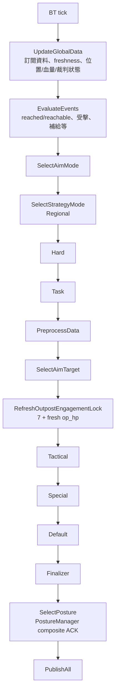
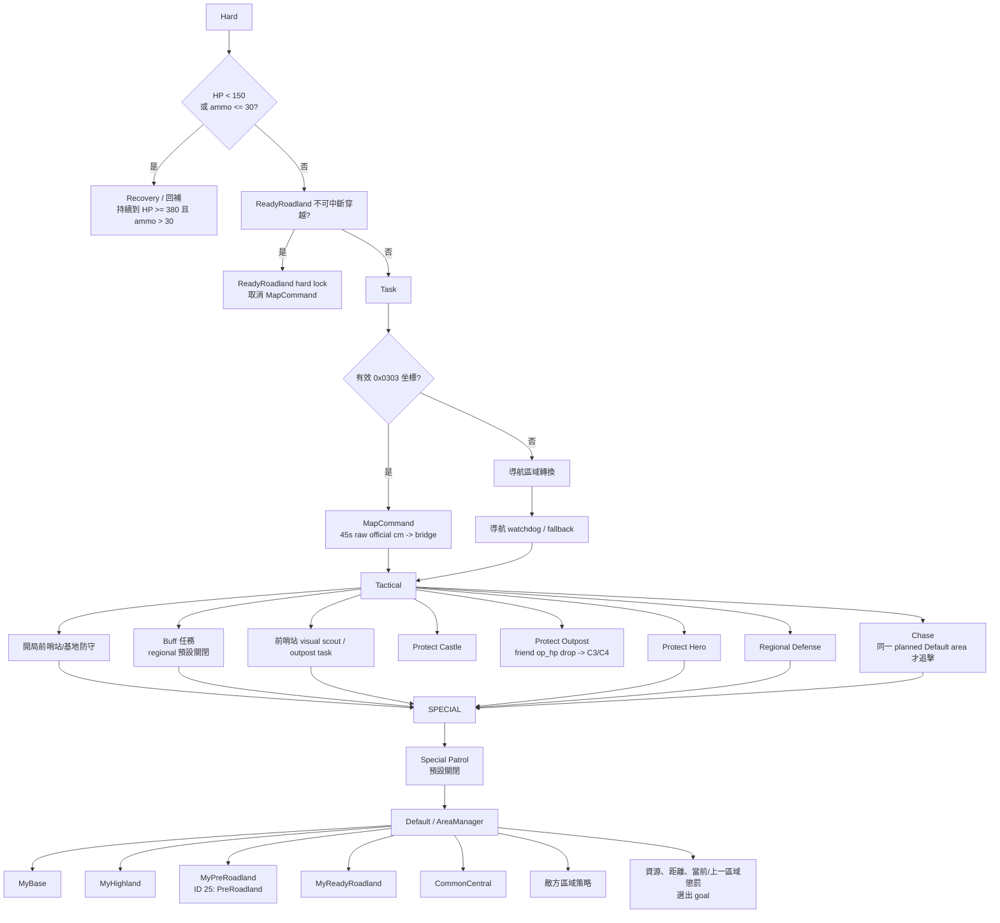

# Regional 決策圖譜

Updated: 2026-07-27

> 範圍：`competition_profile:=regional` 的 `behavior_tree` 決策順序、優先級、導航輸出與姿態選擇。此圖描述 source 現有行為；未自動下發強化姿態命令 `4/5/6`，它們保留給後續任務級觸發。

正式入口、實際 XML、BT/bridge topic owner，以及所有測試用 BT launch 的邊界見
[behavior_tree_runtime_map.md](behavior_tree_runtime_map.md)。
外部 Aim 的 `frame_id`、BT Chase 授權、精確官方敵方點 fallback 與 `/goal_pose` 停距站位的
座標邊界見 [bt_aim_navi_coordinate_chain.md](bt_aim_navi_coordinate_chain.md)。

## 1. 每 tick 的實際順序



`SelectPosture` 在導航/戰術目標決定後才執行：姿態會影響 `SentryCmd`，但不會回頭覆蓋該 tick 已選出的導航目標。

## 2. 區域與任務優先級



`PreRoadland` 與 `ReadyRoadland` 是正式同級 MainArea。`MyPreRoadland` 僅前往 ID 25，
到點後按 `GoalHoldSec` 結束；它可被更高優先級任務取消。`MyReadyRoadland` 保留原本的
`CentralToBase(ID 22) -> BaseToCentral(ID 21)` 強綁定穿越、安全返回、FollowMode 和
可選 FaceMode 行為。正式 `regional_competition.json` 已把兩區加入 `NaviGoal.MyArea`；
`MyReadyRoadland.UseFaceMode` baseline 為 `false`。ID 22 的正式座標為紅 `(515,100)`、藍
`(2285,1400)`，因此兩個穿越點都落在新 ReadyRoadland 邊界內。

`ProtectOutpost` 與敵方前哨 visual scout 是獨立任務。`/ly/friend/op_hp` 僅以 BT 本機收包時間
判新鮮，首次正血量只建立窗口基線；只有 `DamageWindowMs=2000` 內累積下降至少
`DamageThresholdHp=20` 才建立事件，小幅或跨窗口下降不會觸發。新鮮 `0 HP` 立即撤銷 C3/C4
並清空事件；重建後正血量會成為新基線，後續重新達門檻的掉血可再次觸發。事件使用官方厘米 C3（紅
`1011,429`）或 C4（藍 `1789,1071`）並經既有 `/ly/navi/goal_pos_raw -> navi_tf_bridge -> /goal_pose`
鏈路發出。抵達後保持 `SearchHoldSec=30` 秒，新的達門檻下降重置保持；不可達後沉默
`UnreachableCooldownSec=10` 秒，期間新的達門檻下降只排隊到冷卻結束。`Tactical.Priority` 僅仲裁
ProtectCastle、ProtectOutpost、ProtectHero、Chase（數字越小越高）；Hard、Task 與既有
Buff/Outpost aim 仍先於此表，且所有導航仍由 BT 的唯一最終發佈出口發出。

ProtectHero 的全部有效參數由 `Tactical.yaml` 的 `Tactical.ProtectHero` 提供：開局時間、導航
保持、無敵情釋放、Hero 位置/血量新鮮度與目標 base goal 都可直接改 YAML。舊 JSON
`HeroProtection` 只在未提供 YAML 欄位時作相容基線；trace 的 `tactical.protect_hero` 會列出每個
gate，避免只看到 `active=false` 而不知道原因。

Chase 不會跨過 Default 的區域承諾：只有已啟動且可讓出的 Default 任務、敵方新鮮官方座標與
該任務完全相同的 `AreaKey`，並且 `Chase.yaml` 開啟該區時，Tactical 才發布追擊導航輸入。
拒絕後保留原區域任務的既有 goal；它不影響外部 aim 的瞄準或 fire。這條策略在 Tactical 內，
因此優先於目前預設關閉的 Special；未來若開 Special Patrol，可用 `SuppressChase` 主動禁用。

## 3. Regional 的輸入與導航閉環

```mermaid
flowchart LR
  HP[/ly/friend/hp\n/ly/enemy/hp] --> DATA[BT 全域資料]
  OP[/ly/friend/op_hp\n/ly/enemy/op_hp] --> DATA
  AMMO[/ly/game/bullet] --> DATA
  AIM[/ly/aim/armor_targets\n/ly/aim/result] --> DATA
  POS[/ly/friend/uwb_pos\n/ly/navi/position\n/ly/position/data] --> FUSION[SentryPositionFusion] --> DATA
  REACHED[/ly/navi/reached\n/ly/navi/reachable] --> REACH[GoalReachState] --> DATA

  MAP_CMD[/ly/game/map_command\nTypeID 9 / 0x0303] --> REGIONAL
  DATA --> REGIONAL[Regional 決策]
  REGIONAL --> GOAL[/ly/navi/goal]
  REGIONAL --> RAW[/ly/navi/goal_pos_raw]
  REGIONAL --> REL[/ly/navi/target_rel\n追擊]
  REGIONAL --> SPEED[/ly/navi/speed_level\nNavi.yaml 開關；0/1/2]
  RAW --> TF[navi_tf_bridge] --> POSE[/goal_pose]
  REL --> TF
  GOAL --> NAV[外部導航]
  POSE --> NAV
  SPEED --> NAV
  NAV --> REACHED

  TEAM[TypeID 1 GameCode\nIsMyTeamRed] --> SENTRY_INFO[/ly/game/sentry/info\nSentryInfo.self_robot_id]
  SENTRY_INFO --> PATH_BRIDGE
  NAV_PATH[/Path_downsampled\nnav_msgs/Path map/m] --> PATH_BRIDGE[map_path_to_game_path_node\nmap -> official inverse matrix]
  PATH_BRIDGE --> GAME_PATH[/ly/game/path\nMapPath dm + 原 header.stamp]
  GAME_PATH --> REF_PATH[0x02 -> map_data_t]
```

`MapCommand` 只接受官方場地內的坐標模式點，預設持有 45 秒、20cm 去重；5 次 100ms 和後續
1Hz 相同重送不續期。它不是 BaseGoal，任務持有期間會清除舊目標 external-status binding 並暫停
`/ly/navi/reach_state`，因此到達小地圖點不會被誤判為區域任務到點。完整協議與邊界見
`docs/sentry/embedded/map_command_typeid9.md`。

`behavior_tree` 在等待開賽前會打印一次實際生效的 AreaManager/Tactical 配置快照（包括
ProtectOutpost 开关、新鲜度/掉血窗口/门槛、保持/冷却与四项 Tactical 优先级）；之後只在最終
可發布的導航決策 fingerprint 變化時打印 `[DecisionExplain][navi]`。該行由最終
`DecisionIntent` 與最後輸出的表示組成：區域點/小地圖命令使用官方 `cm`，手動前哨 pose 使用
`map` frame 的 `m`，相對追擊使用來源 frame 的 `rel_m`。相對追擊的位置持續更新不會每 tick
刷屏；它在決策、目標類別或 frame 切換時打印，不是每 tick 的除錯 trace。

Regional 的回補、Default 與閒置巡邏也使用同一最終輸出記錄。回補換點時為
`layer=hard reason=recovery`，detail 帶當次觸發動作和 HP/彈量快照；Default AreaTask 換點時
detail 帶 `area_task=<區域> phase=<階段>`；RegionalIdlePatrol 換點時帶
`index=<巡邏序號> hold_sec=<保持秒數>`。同一個最終 goal/坐標重發、HP/彈量或 Default score 的
單獨變化都不會另印一條導航決策說明。

### `speed_level` 與 `vel` 的分工

```mermaid
flowchart LR
  LEVEL[BT speedLevel\nUInt8 僅 0/1/2] --> TOPIC[/ly/navi/speed_level] --> EXT[外部導航\n檔位表不在本倉]
  RAW_VEL[BT naviVelocity.X/Y] --> SCALE[固定 raw * 0.025\n轉 x_mps/y_mps] --> CONTROL[/ly/control/vel] --> GD[gimbal_driver] --> LOWER[下位機]
```

- `Navi.yaml` 的 `Navi.Is_pub_navi_speed_level=true` 才啟用 `speed_level` 發布；它不經
  `gimbal_driver` 或下位機串口。`0=停`、`1=正常`、`2=高速`，其他內部值在發布邊界改為 `1`。
- Recovery 事件固定申請 `2`；其餘正式導航、追擊、小地圖命令與手動前哨導航為 `1`。`speed_level`
  不是 `/ly/control/vel` 的乘數，兩條鏈路在 BT 內互相獨立；外部導航的實際限速/倍率仍不在本倉斷言範圍。

## 4. 姿態選擇與計時來源

```mermaid
flowchart TD
  INFO3[TypeID 10\nsentry_info_3] --> INFO_TOPIC[/ly/game/sentry/info\nremaining seconds + age_ms]
  INFO_TOPIC --> FRESH{has info3 且\nage <= RefereeInfo3FreshMs?\n預設 1500ms}
  POSTURE_STATE[/ly/gimbal/posture\nUInt8 回讀] --> POSTURE_FRESH{本機收包 age <=\nFeedbackFreshMs?\n預設 1000ms}
  LOCAL[本地 AccumSec\n持續累積，永不停止] --> TIMER
  FRESH -->|是| TIMER[PostureManager 計時來源]
  FRESH -->|否| TIMER
  TIMER --> SCORE[SelectDesiredPosture]
  AREA[AreaManager\nTransit / ArrivedHold] --> TRANSIT[Transit override]

  SCORE --> OVERRIDE[硬規則\nRecovery/Buff -> Move\n前哨站狀態/受擊等]
  SCORE --> BASE[普通候選評分\nAttack / Defense / Move]
  FRESH --> REMAIN[普通或強化剩餘秒數]
  REMAIN --> PENALTY[0 秒強懲罰\n1..WarnSec 線性懲罰]
  REMAIN --> HOLD[當前為強化姿態時\n同類別保持 bonus]
  PENALTY --> BASE
  HOLD --> BASE
  OVERRIDE --> TRANSIT
  BASE --> TRANSIT
  TRANSIT --> HYST[ScoreHysteresis\n避免姿態抖動]
  HYST --> CMD[只自動下發 1/2/3\nAttack/Defense/Move]
  POSTURE_FRESH --> ACK[PostureManager\n僅新鮮且匹配才確認 pending]
  ACK --> CMD
  CMD --> TOPIC[/ly/control/posture]
  TOPIC --> SENTCMD[/ly/control/sentry_cmd]
  SENTCMD --> DL[Downlink 0x01\nRM2026 V2.0 0x0120]
```

### 姿態評分的現行配置

| 設定 | 預設 | 作用 |
|---|---:|---|
| `Posture.RefereeInfo3FreshMs` | 1500 ms | `sentry_info_3` 新鮮時才覆蓋官方剩餘秒數 |
| `Posture.FeedbackFreshMs` | 1000 ms | `/ly/gimbal/posture` 僅在本機實際收到回讀後的此窗口內可確認 pending；回讀接收時間還必須不早於該 pending 命令，逾時標記 stale |
| `Posture.RefereeRemainWarnSec` | 20 s | 剩餘秒數進入懲罰區間，也是 Transit 保留 Move 預算的門檻 |
| `Posture.RefereeRemainPenalty` | 5 | 1..WarnSec 的最大候選扣分 |
| `Posture.RefereeZeroRemainPenalty` | 20 | 剩餘 0 秒的強扣分 |
| `Posture.EnhancedCurrentPostureBonus` | 3 | 已是強化姿態時，保持相同普通類別的加分 |

`/ly/gimbal/posture` 是無 header 的 `UInt8`，因此不能從協議上證明下位機採樣時間。BT 使用
`keep_last(1)` 限制積壓，並拒絕在命令前已被 BT 接收的回讀；若要完全保證下位機因果 ACK，必須由
下位機在未來協議中回顯命令序號或時間戳。

只有由 Default regional policy 建立的區域任務，才會把姿態所需的到點語義收斂為
`AreaManager` 內部 hint，沒有第二套停留計時。Buff、前哨、戰術防護等 scoped goal 即使借用同一個
區域狀態機，也保留原有姿態仲裁，不產生此 hint：
`Transit`（行進、超時或不可達保底階段）通常請求 Move；只有已由 goal-scoped composite arrival
確認、且正處於既有 15 秒 hold 的 `ArrivedHold` 才解除該 Move 覆蓋，回到原有目標/受擊/資源評分來選
Attack 或 Defense。新鮮 TypeID 10 `sentry_info_3` 顯示 Move 剩餘小於等於 `RefereeRemainWarnSec` 時，
Transit 會在 Attack/Defense 中選擇剩餘時間較多的一檔，平分時選 Defense；沒有新鮮官方計時則保守維持
Move。Recovery、Buff、前哨、既有硬 Defense、導航與前哨鎖定仲裁順序不改，所有請求仍受 5 秒切換
冷卻、10 秒最短保持與回讀 ACK 約束，故不能宣稱在資料延遲或冷卻期間絕對不會進入弱化。

## 5. 發布與下發

```mermaid
flowchart TB
  REGIONAL[Regional 最終 intent] --> NAV_OUT[導航\ngoal / target_rel / speed_level]
  REGIONAL --> AIM_OUT[瞄準\n/ly/aim/select_target]
  REGIONAL --> FACE_REQ[FaceMode request\nRegional]
  AIM_OUT --> FACE_REQ2[FaceMode request\nBuff / Outpost]
  FACE_REQ --> FACE_MGR[FaceModeManager\n收集與統一仲裁]
  FACE_REQ2 --> FACE_MGR
  FACE_MGR --> FACE_OUT[/ly/face_mode/target_raw]
  FACE_OUT --> FACE_SOLVER[map_aim_point_node]
  FACE_SOLVER --> FACE_ANGLES[/ly/face_mode/angles]
  FACE_ANGLES --> FACE_MGR
  FACE_MGR --> GIMBAL_OUT[唯一最終仲裁\nangles / firecode]
  REGIONAL --> POSTURE_OUT[姿態\nposture / sentry_cmd]
  REGIONAL --> POS_OUT[融合自身座標\n/ly/bt/sentry_position]

  GIMBAL_OUT --> D0[0x00 GimbalControlFrame]
  POSTURE_OUT --> D1[0x01 SentryCommandFrame]
  POS_OUT --> D4[0x04 SentryCoordinateFrame]
  D0 --> LOWER[下位機]
  D1 --> LOWER
  D4 --> LOWER
```

## 6. Source of truth

- `src/behavior_tree/Scripts/main.xml`
- `src/behavior_tree/src/StrategyManager.cpp`、`src/behavior_tree/src/GameLoop.cpp`、`src/behavior_tree/src/FaceModeManager.cpp`、`src/behavior_tree/src/ChasePolicy.cpp`
- `src/behavior_tree/config/AreaManager.yaml`、`src/behavior_tree/config/Navi.yaml`、`src/behavior_tree/config/Task.yaml`、`src/behavior_tree/config/Chase.yaml`、`src/behavior_tree/config/Special.yaml`
- `src/behavior_tree/src/PostureLogic.cpp`、`src/behavior_tree/src/PostureManager.cpp`
- `src/behavior_tree/src/PublishMessage.cpp`
- `src/behavior_tree/Scripts/ConfigJson/regional_competition.json`
