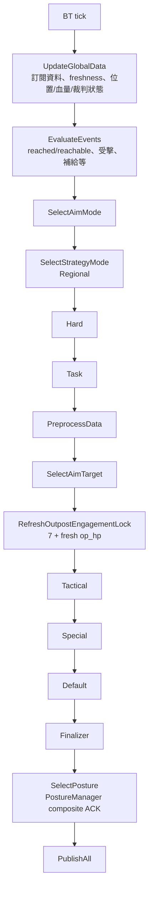
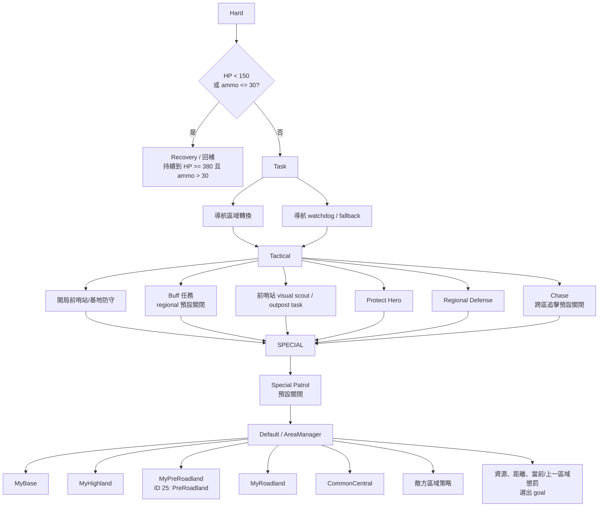

# Regional 決策圖譜

Updated: 2026-07-13

> 範圍：`competition_profile:=regional` 的 `behavior_tree` 決策順序、優先級、導航輸出與姿態選擇。此圖描述 source 現有行為；未自動下發強化姿態命令 `4/5/6`，它們保留給後續任務級觸發。

## 1. 每 tick 的實際順序



`SelectPosture` 在導航/戰術目標決定後才執行：姿態會影響 `SentryCmd`，但不會回頭覆蓋該 tick 已選出的導航目標。

## 2. 區域與任務優先級



`PreRoadland` 與 `Roadland` 是正式同級 MainArea。`MyPreRoadland` 僅前往 ID 25，
到點後按 `GoalHoldSec` 結束；它可被更高優先級任務取消。`MyRoadland` 保留原本的
`CentralToBase(ID 22) -> BaseToCentral(ID 21)` 強綁定穿越、安全返回、FollowMode 和
FaceMode 行為。ID 22 的正式座標為紅 `(515,100)`、藍 `(2285,1400)`，因此兩個穿越點
都落在新 Roadland 邊界內。

## 3. Regional 的輸入與導航閉環

```mermaid
flowchart LR
  HP[/ly/friend/hp\n/ly/enemy/hp] --> DATA[BT 全域資料]
  OP[/ly/friend/op_hp\n/ly/enemy/op_hp] --> DATA
  AMMO[/ly/game/bullet] --> DATA
  AIM[/ly/aim/armor_targets\n/ly/aim/result] --> DATA
  POS[/ly/friend/uwb_pos\n/ly/navi/position\n/ly/position/data] --> FUSION[SentryPositionFusion] --> DATA
  REACHED[/ly/navi/reached\n/ly/navi/reachable] --> REACH[GoalReachState] --> DATA

  DATA --> REGIONAL[Regional 決策]
  REGIONAL --> GOAL[/ly/navi/goal]
  REGIONAL --> RAW[/ly/navi/goal_pos_raw]
  REGIONAL --> REL[/ly/navi/target_rel\n追擊]
  REGIONAL --> SPEED[/ly/navi/speed_level\n策略檔位原樣發送]
  RAW --> TF[navi_tf_bridge] --> POSE[/goal_pose]
  REL --> TF
  GOAL --> NAV[外部導航]
  POSE --> NAV
  SPEED --> NAV
  NAV --> REACHED

  TEAM[TypeID 1 GameCode\nIsMyTeamRed] --> SENTRY_INFO[/ly/game/sentry/info\nSentryInfo.self_robot_id]
  SENTRY_INFO --> PATH_BRIDGE
  NAV_PATH[/ly/navi/path\nnav_msgs/Path map/m] --> PATH_BRIDGE[map_path_to_game_path_node\nmap -> official inverse matrix]
  PATH_BRIDGE --> GAME_PATH[/ly/game/path\nMapPath dm + 原 header.stamp]
  GAME_PATH --> REF_PATH[0x02 -> map_data_t]
```

### `speed_level` 與 `vel` 的分工

```mermaid
flowchart LR
  LEVEL[BT speedLevel\nUInt8 0/1/...] --> TOPIC[/ly/navi/speed_level] --> EXT[外部導航\n檔位表不在本倉]
  RAW_VEL[BT naviVelocity.X/Y] --> SCALE[固定 raw * 0.025\n轉 x_mps/y_mps] --> CONTROL[/ly/control/vel] --> GD[gimbal_driver] --> LOWER[下位機]
```

- `speed_level` 不是 `/ly/control/vel` 的乘數，兩條鏈路在 BT 內互相獨立。
- 目前本倉只確認 BT 發送 `UInt8`；外部導航端 `0/1/2` 對應的限速或倍率未納入本圖，不能在此倉推定。

## 4. 姿態選擇與計時來源

```mermaid
flowchart TD
  INFO3[TypeID 10\nsentry_info_3] --> INFO_TOPIC[/ly/game/sentry/info\nremaining seconds + age_ms]
  INFO_TOPIC --> FRESH{has info3 且\nage <= RefereeInfo3FreshMs?\n預設 1500ms}
  LOCAL[本地 AccumSec\n持續累積，永不停止] --> TIMER
  FRESH -->|是| TIMER[PostureManager 計時來源]
  FRESH -->|否| TIMER
  TIMER --> SCORE[SelectDesiredPosture]

  SCORE --> OVERRIDE[硬規則\nRecovery/Buff -> Move\n前哨站狀態/受擊等]
  SCORE --> BASE[普通候選評分\nAttack / Defense / Move]
  FRESH --> REMAIN[普通或強化剩餘秒數]
  REMAIN --> PENALTY[0 秒強懲罰\n1..WarnSec 線性懲罰]
  REMAIN --> HOLD[當前為強化姿態時\n同類別保持 bonus]
  PENALTY --> BASE
  HOLD --> BASE
  OVERRIDE --> HYST[ScoreHysteresis\n避免姿態抖動]
  BASE --> HYST
  HYST --> CMD[只自動下發 1/2/3\nAttack/Defense/Move]
  CMD --> TOPIC[/ly/control/posture]
  TOPIC --> SENTCMD[/ly/control/sentry_cmd]
  SENTCMD --> DL[Downlink 0x01\nRM2026 V2.0 0x0120]
```

### 姿態評分的現行配置

| 設定 | 預設 | 作用 |
|---|---:|---|
| `Posture.RefereeInfo3FreshMs` | 1500 ms | `sentry_info_3` 新鮮時才覆蓋官方剩餘秒數 |
| `Posture.RefereeRemainWarnSec` | 20 s | 剩餘秒數進入懲罰區間 |
| `Posture.RefereeRemainPenalty` | 5 | 1..WarnSec 的最大候選扣分 |
| `Posture.RefereeZeroRemainPenalty` | 20 | 剩餘 0 秒的強扣分 |
| `Posture.EnhancedCurrentPostureBonus` | 3 | 已是強化姿態時，保持相同普通類別的加分 |

## 5. 發布與下發

```mermaid
flowchart TB
  REGIONAL[Regional 最終 intent] --> NAV_OUT[導航\ngoal / target_rel / speed_level]
  REGIONAL --> AIM_OUT[瞄準\n/ly/aim/select_target]
  REGIONAL --> FACE_REQ[FaceMode request\nRegional]
  AIM_OUT --> FACE_REQ2[FaceMode request\nBuff / Outpost]
  FACE_REQ --> FACE_MGR[FaceModeManager\n收集與統一仲裁]
  FACE_REQ2 --> FACE_MGR
  FACE_MGR --> FACE_OUT[/ly/face_mode/target_raw]
  FACE_OUT --> FACE_SOLVER[map_aim_point_node]
  FACE_SOLVER --> FACE_ANGLES[/ly/face_mode/angles]
  FACE_ANGLES --> FACE_MGR
  FACE_MGR --> GIMBAL_OUT[唯一最終仲裁\nangles / firecode]
  REGIONAL --> POSTURE_OUT[姿態\nposture / sentry_cmd]
  REGIONAL --> POS_OUT[融合自身座標\n/ly/bt/sentry_position]

  GIMBAL_OUT --> D0[0x00 GimbalControlFrame]
  POSTURE_OUT --> D1[0x01 SentryCommandFrame]
  POS_OUT --> D4[0x04 SentryCoordinateFrame]
  D0 --> LOWER[下位機]
  D1 --> LOWER
  D4 --> LOWER
```

## 6. Source of truth

- `src/behavior_tree/Scripts/main.xml`
- `src/behavior_tree/src/StrategyManager.cpp`、`src/behavior_tree/src/GameLoop.cpp`、`src/behavior_tree/src/FaceModeManager.cpp`
- `src/behavior_tree/config/AreaManager.yaml`、`src/behavior_tree/config/Task.yaml`、`src/behavior_tree/config/Special.yaml`
- `src/behavior_tree/src/PostureLogic.cpp`、`src/behavior_tree/src/PostureManager.cpp`
- `src/behavior_tree/src/PublishMessage.cpp`
- `src/behavior_tree/Scripts/ConfigJson/regional_competition.json`
