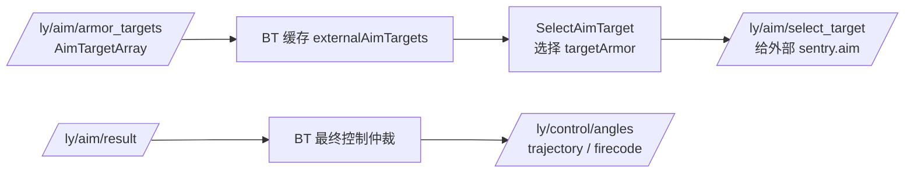
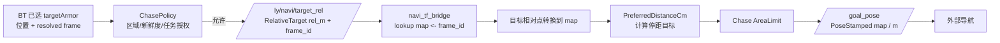
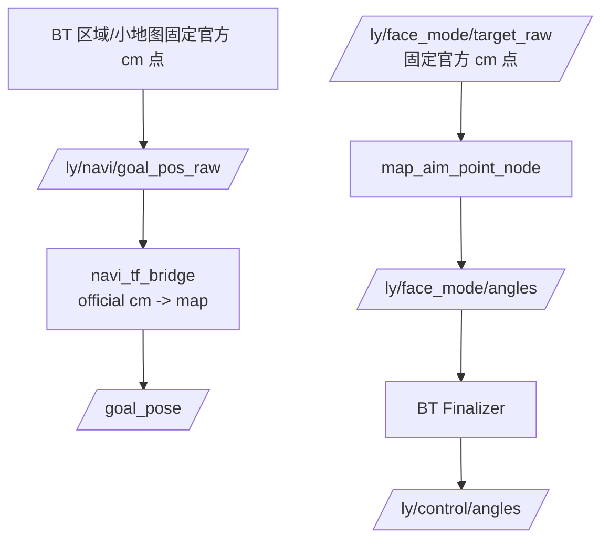

# BT Aim、追击与坐标链路

Updated: 2026-07-31

> 范围：正式入口 `./scripts/start.sh gated --mode regional` 中，外部
> `/ly/aim/armor_targets` 如何变成 BT 的选敌/追击输入、`/goal_pose` 与
> `/ly/navi/target_official` 的来源，以及它们各自的坐标语义。此页只描述当前源码；
> 外部 `sentry.aim`、`sentry_tf` 和导航的内部实现不在本仓断言范围内。

正式 BT 入口、XML 顺序、其他测试 launch 和最终 topic owner 见
[behavior_tree_runtime_map.md](behavior_tree_runtime_map.md)。区域任务和 Chase 授权条件见
[decision_framework.md](decision_framework.md)。navi bridge 参数、标定矩阵和 FaceMode 独立链路见
[../../modules/2026-05-04_navi_tf_bridge.md](../../modules/2026-05-04_navi_tf_bridge.md)。

## 1. 结论先行

正式 Chase **不是**“BT 写死 `gimbal_world` 后自己查 TF 并生成 `/goal_pose`”。

- BT 优先保留外部 `AimTarget` 自带的 `header.frame_id`。
- 只有 target 和 array 都未填写 frame 时，BT 才使用
  `ExternalAim.TargetDefaultFrame`；regional 当前值为 `gimbal_world`。
- BT 负责选敌与 Chase 授权，发布 `/ly/navi/target_rel`；它不执行 TF 查询。
- `navi_tf_bridge/target_rel_to_goal_pos_node` 负责按该 frame 查询
  `source_frame -> map` TF，按停距生成 `/goal_pose`。
- `/goal_pose` 是哨兵的导航站位，不是敌人坐标；不可用它反推官方敌方位置。

`gimbal_world` 是当前正式默认值，不是对带有 `frame_id` 的目标的强制覆盖。

## 2. 外部 Aim 到 BT 选敌



对数组中每个有效 `AimTarget`，BT 缓存位置、距离、armor id 与 resolved frame。frame 的严格优先级是：

1. `target.header.frame_id`
2. `AimTargetArray.header.frame_id`
3. `ExternalAim.TargetDefaultFrame`

当前 regional JSON 的第三层是 `gimbal_world`。因此外部 aim 若实际给的是
`gx_camera_0` 或其他相机系坐标，应在 target 或 array header 写出对应 frame；FaceMode 的
`gx_camera_0` 设置不会替 Chase 修正一个缺失或错误的 frame。

普通瞄准与最终 fire 走 `/ly/aim/result -> behavior_tree -> /ly/control/*`，其角度/弹道求解由外部
`sentry.aim` 完成。BT 不把视觉位置重新解成 aim 角度，也不把 `/goal_pose` 回灌为 aim 位置。

### 可见目标的直接瞄准

只要 `/ly/aim/armor_targets` 中有新鲜、有效且未被 `AimTargetIgnore` 排除的正式
`ArmorType`（`id=0..7`：Base、Hero、Engineer、Infantry1/2/3、Sentry、Outpost），BT 都会候选。
多个目标同时存在时选择最近的一個，距离相同时按较小 ID 稳定决胜；因此 `id=7` 前哨不再是唯一的
特殊直选类型。正在生效的 Outpost engagement lock 仍会保留前哨锁定，这是任务安全语义；除此之外
BT 向 `/ly/aim/select_target` 回传选中目标的同一份视觉坐标与 frame。

已选中的新鲜视觉目标会参与 Attack 姿态评分；正常时会请求 Attack，仍可被 Recovery、Buff、受击
HardDefense、导航 HardMove、任务行进和既有 5 秒姿态冷却覆盖。该规则不重启 Task、不覆盖
Task/Tactical 的导航 owner，也不单独发布 Chase `/goal_pose`。是否实际 `follow/fire` 仍由外部
`sentry.aim` 在 `/ly/aim/result` 中按自身有效性与安全门控决定。

## 3. 授权后的 Chase 到 `/goal_pose`



只有 Tactical 层认定 Chase 被授权时，BT 才把选中目标作为
`/ly/navi/target_rel` 发布。发布消息保持已解析的 frame；坐标仍是 source frame 的 `m`，
不是官方地图 `cm`。

bridge 的 `use_msg_frame_id=true` 时，非空消息 `frame_id` 是唯一 TF 源 frame。若其为空，bridge
才按 `target_rel_default_frame=gimbal_world`，再以 `base_link` 作为兼容候选依次尝试。成功后 bridge
基于 `PreferredDistanceCm` 与 deadband 求出“离敌人多远时停车”的 map 点，并输出
`/goal_pose`。所以：

- `/goal_pose.pose.position` 是底盘应去的 map/m 点；
- 它通常与敌人 exact map 点不同；
- 追击未授权时，armor target 的出现本身不会生成该条 Chase `/goal_pose`。

同一 tick 若官方位置 Chase 已激活，BT 发布 `/ly/navi/goal_pos_raw`；否则才发布
`/ly/navi/target_rel`。两者由同一 bridge 输出 `/goal_pose`，避免双写该 topic。

### ProtectCastle 外围 Chase

ProtectCastle 先始终选出一个 Castle 固定防守点，作为导航回退；它不另选敌人。当且仅当占用
状态为 `PerimeterDefense` 时，BT 把当前已选 `targetArmor` 交给同一 `TryApplyChaseTactical()`：

- `ApproachCastle`（无人/敌方占堡）与 `HoldCastle`（我已确认在 Castle）绝不授权 Chase。
- `PerimeterDefense` 只接受新鲜、精确落在 `MyBase` 的当前选中目标。最近邻区域推断、跨区或过期
  官方位置均被 `ChasePolicy` 拒绝。
- 当前 `/ly/navi/reachable=false` 已进入 composite `Unreachable` 时，本拍不授权 Chase；策略保留的
  Castle 外围点立即成为输出回退。下一拍也会重新判定目标和导航状态。
- `ChasePolicy.MyBase` 是唯一开关，当前 source YAML 为 `true`。关掉它会同时禁止 MyBase 的
  Default Chase 与 ProtectCastle 外围 Chase，不影响 `ApproachCastle` / `HoldCastle` 固定防守。

这条防守授权不创建虚假的 Default AreaTask，也不复制选敌、TF、停距、官方坐标或导航发布代码。

## 4. 精确敌人位置回写到官方地图

```mermaid
flowchart LR
  ARMOR[/ly/aim/armor_targets\n每个有效 target/] --> FRAME[读取 target/array frame]
  FRAME --> TF[TF: source frame -> map]
  TF --> EXACT[精确 target map 点]
  EXACT --> INV[raw-goal static calibration 逆变换]
  INV --> OFFICIAL[/ly/navi/target_official\n[x_cm, y_cm, armor_type]/]
  OFFICIAL --> FUSION[BT enemyRobots 位置 fallback]
  LOWER[/ly/position/data\n下位机/裁判官方位置/] --> PRIORITY[同 ID 优先级]
  PRIORITY --> FUSION
```

bridge 收到 `/ly/aim/armor_targets` 后，对**每一个有效 target**独立按相同 frame 规则转换到
`map`，随后使用 raw-goal static calibration 的逆矩阵，发布其官方地图 `cm` 与 armor id 到
`/ly/navi/target_official`。这条回写不依赖当前是否允许 Chase，也不读取 `/goal_pose`。

BT 对同一敌方 ID 的位置优先级为：

1. 新鲜、非零的 `/ly/position/data`（下位机/裁判官方位置）
2. `/ly/navi/target_official`（由视觉目标经 TF 与逆矩阵得到的 fallback）

当第一项在 `Chase.OfficialPositionFreshMs` 内有效时，BT 忽略第二项；否则才用 fallback，并将
`/ly/enemy/info.position_source` 标记为 `navi_target_official`。这保证视觉换算不会覆盖更权威、
更直接的同 ID 官方位置。

正式入口的 `config/common.yaml` 可设置：

```yaml
chase:
  enable_navi_target_official_fallback: false
```

当前默认 `false`，BT 完全忽略
`/ly/navi/target_official`，不会用视觉反算坐标更新敌方状态或触发区域防御。bridge 仍然发布该
topic，便于复盘，且 `/ly/position/data`、外部 aim、`/ly/navi/target_rel` 与 `/goal_pose` 均不受影响。

## 5. 与固定点、FaceMode 的边界



- 固定区域点与小地图命令走 `/ly/navi/goal_pos_raw`，由 bridge 做 official `cm -> map m`；不是
  `/ly/navi/target_rel` 追击链。
- `goal_pose_uniform_scale` 是 bridge 最终 `/goal_pose` 的可调平面比例；默认 `1.0`。它对固定
  官方点和 Chase 的 `position.x/y` 同时生效，按 map 原点等比例缩放，不改 BT 的官方 cm、
  `/ly/navi/target_official`、`/ly/navi/target_map`、Z 或姿态。
  正式入口可临时传 `goal_pose_uniform_scale:=0.95`；默认值来自
  `navi_tf_bridge/config/tf_config.yaml`，改后重启（非 symlink install 需要重新构建该包）。它必须是
  有限正数，非法值记录 WARN 并回退 `1.0`。
- FaceMode 的相机主/备 frame（正式配置 `gx_camera_0`、`gx_camera_1`）只属于
  `map_aim_point_node` 的固定朝向求解；不决定 Chase 的 source frame。
- FaceMode solver 只发布 `/ly/face_mode/angles`，最终 `/ly/control/angles` 仍由 BT 统一仲裁。

## 6. 现场核对

正式启动后的 bridge 起始日志应显示：

```text
target_rel_default_frame=gimbal_world
armor_targets_in=/ly/aim/armor_targets
target_official_out=/ly/navi/target_official
goal_pose_out=/goal_pose
```

可按以下顺序观测，不改变任何控制逻辑：

```bash
ros2 topic echo /ly/aim/armor_targets
ros2 topic echo /ly/navi/target_official
ros2 topic echo /ly/navi/target_rel
ros2 topic echo /goal_pose
ros2 topic echo /ly/enemy/info
```

有视觉目标但 Tactical 未授权 Chase 时，预期能看到 `/ly/navi/target_official`，但不应把没有的
`/ly/navi/target_rel` 或 `/goal_pose` 误判为转换失败。需要同时确认 `/ly/navi/target_rel.header.frame_id`
与外部 `AimTarget` 的实际 frame 一致。

## 7. Source of truth

- `src/behavior_tree/src/SubscribeMessage.cpp`：`AimTarget` frame 解析、BT target cache、
  `/ly/navi/target_official` 的同 ID fallback 优先级。
- `src/behavior_tree/src/GameLoop.cpp`、`src/behavior_tree/src/StrategyManager.cpp`：选敌、
  `TryApplyChaseTactical()` 的 BT 授权位置，以及 ProtectCastle 外围的显式 MyBase 授权。
- `src/behavior_tree/src/PublishMessage.cpp`：`/ly/navi/target_rel` 和
  `/ly/navi/goal_pos_raw` 的互斥发布。
- `src/navi_tf_bridge/src/chase_pointer.cpp`：frame candidates、停距相对点、TF 到 `map`。
- `src/navi_tf_bridge/src/target_rel_to_goal_pos_node.cpp`：Chase `/goal_pose`、每个 armor target 的
  exact map/official fallback 转换。
- `src/navi_tf_bridge/src/goal_output.cpp`：`map/m` 到 `/goal_pose` 的输出格式。
- `src/navi_tf_bridge/config/tf_config.yaml`、
  `src/behavior_tree/Scripts/ConfigJson/regional_competition.json`：当前正式 fallback frame 配置。

改动其中任一 topic、frame 优先级、TF owner、坐标单位、停距算法或同 ID 位置优先级时，必须同步更新
本页、[behavior_tree_runtime_map.md](behavior_tree_runtime_map.md) 和
[../../modules/2026-05-04_navi_tf_bridge.md](../../modules/2026-05-04_navi_tf_bridge.md)。Markdown 链接就是
文档图谱的边；不维护独立 graph 数据。
